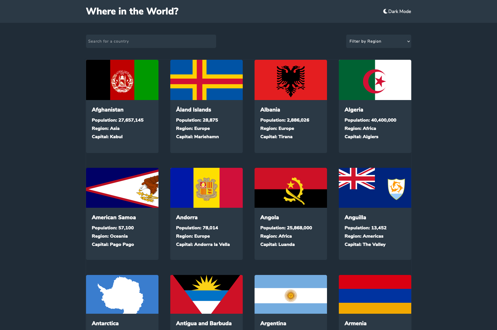

# Frontend Mentor - REST Countries API with color theme switcher solution

This is a solution to the [REST Countries API with color theme switcher challenge on Frontend Mentor](https://www.frontendmentor.io/challenges/rest-countries-api-with-color-theme-switcher-5cacc469fec04111f7b848ca).

## Table of contents

- [Overview](#overview)
  - [The challenge](#the-challenge)
  - [Screenshot](#screenshot)
  - [Links](#links)
- [My process](#my-process)
  - [Built with](#built-with)
  - [What I learned](#what-i-learned)
  - [Continued development](#continued-development)
  - [Useful resources](#useful-resources)
- [Author](#author)
- [Acknowledgments](#acknowledgments)

## Overview

### The challenge

Users should be able to:

- See all countries from the API on the homepage
- Search for a country using an `input` field
- Filter countries by region
- Click on a country to see more detailed information on a separate page
- Click through to the border countries on the detail page
- Toggle the color scheme between light and dark mode *(optional)*

### Screenshot

### Links

- Solution URL: [Add solution URL here](https://github.com/joshuagraber/rest-countries-api)
- Live Site URL: [Add live site URL here](TK)

## My process

### Built with

- [React](https://reactjs.org/) - JS library
- REST API integration
- Flexbox
- CSS Grid
- Mobile-first workflow

### What I learned

I learned a lot about React.js through this project, including handling API/JSON data, and using Router.

### Continued development

I feel that the search and sorting functions could be more smoothly integrated using React Router API. Once I feel more confident with Router (and / or Hooks), I plan to refactor using those techniques.

### Useful resources

- [Treehouse](https://www.teamtreehouse.com) - I finished the React track with Treehouse, and that was enough knowledge to complete this project. Shout out to Guil Hernandez!

## Author

- Website - [Joshua Graber](https://www.joshuagraber.com)
- Frontend Mentor - [@joshuagraber](https://www.frontendmentor.io/profile/joshuagraber)
- Github - [@joshuagraber](https://www.twitter.com/yourusername)

## Acknowledgments

This is where you can give a hat tip to anyone who helped you out on this project. Perhaps you worked in a team or got some inspiration from someone else's solution. This is the perfect place to give them some credit.

- [Sankara](https://www.youtube.com/channel/UCeDWS6WbftXe9-6QQFMrKAQ) - I watched Sankara's video on this challenge before I began, and his structure helped me to develop my own, which I think worked better for me.